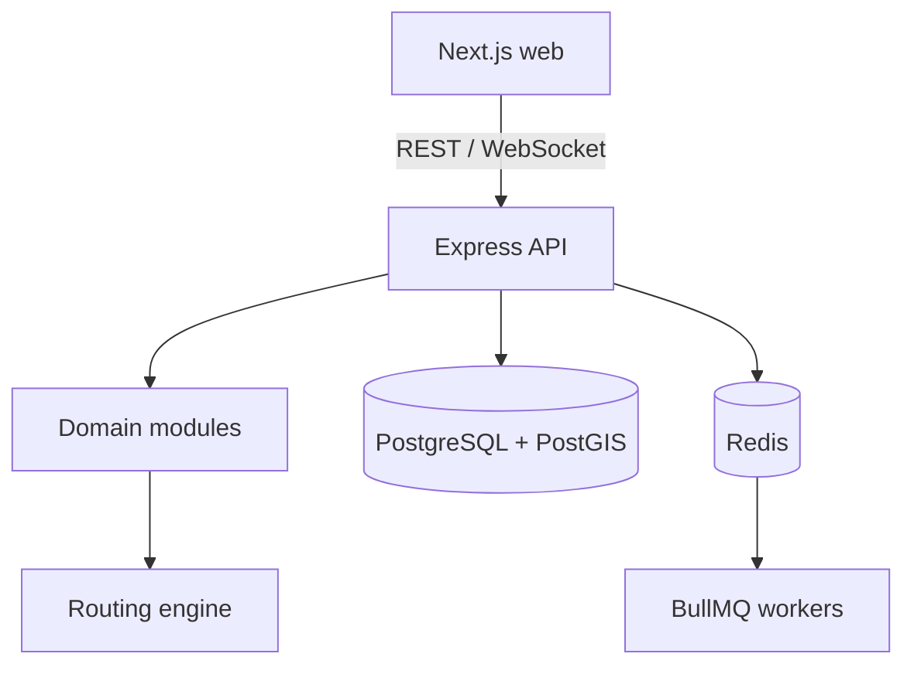

# SafeRoute

SafeRoute is a community safety navigation platform that will recommend **fastest**, **balanced**, and **safest** routes using geospatial risk data and a dynamically weighted road graph.

> Current status: Phase 1 foundation is implemented. Authentication, incident reporting, and routing are deliberately not presented as complete yet.

## Technical identity

SafeRoute is a modular monolith, not a collection of microservices. Its core is a dedicated routing engine that will combine A* pathfinding with configurable distance and safety costs.



Kafka and an API gateway are intentionally excluded. PostgreSQL/PostGIS will handle spatial queries, Redis will cache expensive route results, and BullMQ will run asynchronous risk recalculation and report-expiry work.

## Phase 1 contents

- pnpm TypeScript monorepo
- Next.js and Tailwind web application
- Express API with security middleware, correlation IDs, and structured logs
- separate liveness and dependency-aware readiness checks
- PostgreSQL 17 with PostGIS and a spatially capable schema foundation
- Redis foundation for future cache and BullMQ work
- Dockerfiles and Docker Compose health checks
- strict TypeScript, ESLint, Prettier, Vitest, and GitHub Actions CI
- graceful API shutdown and sanitized log configuration

## Repository layout

```text
apps/
  api/                  Express modular-monolith API
  web/                  Next.js web client
packages/
  shared/               Cross-application contracts
docker/postgres/        PostGIS initialization
.github/workflows/      Continuous integration
```

Future domain modules belong under `apps/api/src/modules`; graph structures, A*, and scoring will live under `apps/api/src/routing-engine`. Keeping these boundaries inside one deployable API makes development simpler without mixing domain logic into controllers.

## Local development

Requirements:

- Node.js 22+
- pnpm 10+
- Docker with Compose (for PostgreSQL/PostGIS and Redis)

```bash
cp .env.example .env
pnpm install
docker compose up -d postgres redis
pnpm dev
```

Open the web app at `http://localhost:3000`. The API listens at `http://localhost:4000`.

Health endpoints:

```text
GET /api/v1/health/live   process liveness
GET /api/v1/health/ready  PostgreSQL and Redis readiness
```

Run the entire stack in containers:

```bash
docker compose up --build
```

## Verification

```bash
pnpm format:check
pnpm lint
pnpm typecheck
pnpm test
pnpm build
```

The first successful dependency installation generates `pnpm-lock.yaml`; commit it before changing dependencies further so local, Docker, and CI installations remain reproducible.

## Planned phases

1. **Foundation** — complete
2. **Authentication and incidents** — users, secure sessions, reports, PostGIS nearby queries
3. **Routing engine** — graph model, configurable cost profiles, A*, deterministic tests
4. **Safety intelligence** — confidence, confirmation, time decay, affected-road calculations
5. **Background processing** — BullMQ, risk recalculation, expiry, caching
6. **Map experience** — route comparison, rendering, report submission
7. **Real-time navigation** — high-risk updates and rerouting suggestions
8. **Production hardening** — rate limits, metrics, indexes, performance tests

## Phase 1 trade-offs

- Database migrations and an ORM are deferred until the Phase 2 domain schema is designed; Phase 1 only enables PostGIS.
- Redis is connected for readiness but caching and BullMQ are deferred until their domain behavior is known.
- The landing screen communicates the product direction; an interactive map belongs to Phase 6.
- Docker Compose uses local development credentials. Production credentials must come from a secret manager.

## Safety and privacy direction

The finished system will avoid persistent navigation histories by default, hide reporter identity, rate-limit report submission, validate evidence uploads, and use aggregated risk data rather than expose precise user movement.

## License

No license has been selected yet.
