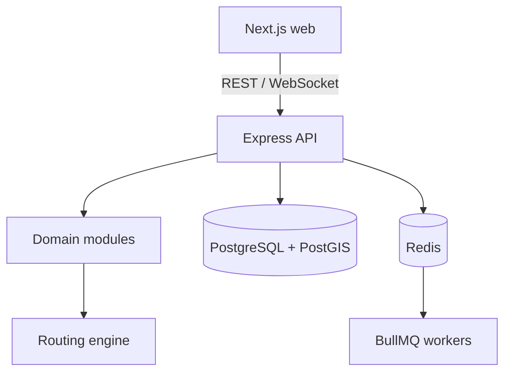

# SafeRoute

SafeRoute is a community safety navigation platform that will recommend **fastest**, **balanced**, and **safest** routes using geospatial risk data and a dynamically weighted road graph.

> Current status: Phases 1–8 are implemented. The planned production build is complete.

## Technical identity

SafeRoute is a modular monolith, not a collection of microservices. Its core is a dedicated routing engine that will combine A* pathfinding with configurable distance and safety costs.



Kafka and an API gateway are intentionally excluded. PostgreSQL/PostGIS will handle spatial queries, Redis will cache expensive route results, and BullMQ will run asynchronous risk recalculation and report-expiry work.

## Implemented foundation

- pnpm TypeScript monorepo
- Next.js and Tailwind web application
- Express API with security middleware, correlation IDs, and structured logs
- separate liveness and dependency-aware readiness checks
- PostgreSQL 17 with PostGIS and a spatially capable schema foundation
- Redis foundation for future cache and BullMQ work
- Dockerfiles and Docker Compose health checks
- strict TypeScript, ESLint, Prettier, Vitest, and GitHub Actions CI
- graceful API shutdown and sanitized log configuration
- secure scrypt password hashing and short-lived signed access tokens
- opaque, hashed, rotating refresh sessions with reuse detection
- role-based authorization for `USER`, `MODERATOR`, and `ADMIN`
- PostGIS incident storage, radius queries, and GiST spatial indexes
- duplicate-safe community confirmation/dispute recording
- reporter identity removed from public incident responses
- rate-limited incident submission and moderator verification/rejection
- typed road graph with validated nodes, directed edges, and normalized risk factors
- binary min-priority queue and A* pathfinding with an admissible geographic heuristic
- configurable `FASTEST`, `BALANCED`, and `SAFEST` optimization profiles
- distance-weighted safety scores, route warnings, geometry, duration, and search metrics
- PostGIS road-node and road-segment schema with a demonstrable Noida seed graph
- trust-, evidence-, community-, and moderation-aware incident confidence scoring
- category-specific exponential time decay for transient and persistent hazards
- severity × confidence × time-decay effective-risk calculation
- severity-scaled PostGIS affected-road matching and explainable per-report risk sources
- independent-union aggregation of live reports into separate dynamic road-risk layers
- baseline and dynamic risk composition when loading the routing graph
- BullMQ risk-recalculation jobs with exponential retries and retained failures
- periodic incident-expiry and category time-decay refresh jobs
- a separately deployable background worker with graceful shutdown
- Redis route-result caching with TTLs and graph-version invalidation
- responsive route-planning workspace with a projected Noida road-network map
- interactive Fastest, Balanced, and Safest route comparison with risk summaries
- nearby community-incident visualization and route warning counts
- session restoration, sign-in/registration, and authenticated hazard submission
- Redis Pub/Sub safety events shared across worker and API instances
- origin-checked WebSocket gateway with heartbeat-based stale-client cleanup
- browser reconnection with bounded exponential backoff and live status feedback
- user-controlled rerouting suggestions when the safest path changes
- protected Prometheus metrics for HTTP latency, traffic, process health, and realtime delivery
- layered API/auth/report/route rate limits and bounded WebSocket capacity/backpressure
- production database indexes, query timeouts, bounded request bodies, and shutdown deadlines

## Core API

```text
POST  /api/v1/auth/register
POST  /api/v1/auth/login
POST  /api/v1/auth/refresh
POST  /api/v1/auth/logout
GET   /api/v1/auth/me

POST  /api/v1/incidents
GET   /api/v1/incidents/nearby
GET   /api/v1/incidents/:id
POST  /api/v1/incidents/:id/confirm
POST  /api/v1/incidents/:id/dispute
PATCH /api/v1/incidents/:id/status

GET   /api/v1/routes/nodes
POST  /api/v1/routes/calculate
GET   /api/v1/metrics (dedicated bearer token)
WS    /api/v1/realtime
```

Access tokens are returned in the response body and sent as `Authorization: Bearer <token>`.
Refresh tokens are random opaque values stored only as SHA-256 hashes and transported in an HTTP-only, SameSite cookie. Rotation is atomic; replaying a revoked token invalidates the user’s remaining active sessions.

Route calculation accepts road-node IDs and an optional subset of route preferences:

```json
{
  "originNodeId": "sector-62",
  "destinationNodeId": "electronic-city",
  "preferences": ["FASTEST", "BALANCED", "SAFEST"]
}
```

The edge objective uses consistent distance units:

```text
edgeCost =
  distanceWeight × distanceMeters
  + safetyWeight × combinedRisk × distanceMeters × riskDistanceMultiplier
```

Multiplying risk by distance models exposure and prevents road segmentation from changing a route’s total risk. The A* heuristic uses only weighted straight-line distance, so it never adds an unproven safety cost and remains admissible.

### Safety intelligence

Each active report contributes an effective risk to nearby road segments:

```text
confidence =
  50% reporter trust + 35% community signal + 15% evidence signal

effectiveRisk = severity / 5 × confidence × categoryTimeDecay
```

Community influence grows with participation, pending reports are capped at `0.85`, verified reports have a `0.90` floor, and rejected or expired reports contribute zero. Time decay uses category-specific half-lives: accidents decay in hours, closures and weather hazards in days, while lighting and isolation concerns persist for months.

Reports affect active roads within `100 + severity × 120` metres. Reports of the same risk type are aggregated as `1 - product(1 - effectiveRisk)`, which captures compounding evidence without exceeding one. The resulting live layer is stored separately from the baseline map layer; routing composes them as `1 - (1 - baseline) × (1 - dynamic)`.

### Background processing and caching

Incident create, evaluation, and moderation requests enqueue BullMQ jobs instead of recalculating every nearby road inside the HTTP request. The worker retries transient failures with exponential backoff and retains exhausted jobs for diagnosis. A periodic maintenance job marks due reports as expired and refreshes every active report so category time decay continues to affect routing even when no user action occurs.

Calculated routes are cached in Redis for 120 seconds. Cache keys include a graph-version value; after a risk job changes road weights, the worker increments that version. Old values expire naturally and can no longer be returned, avoiding blocking wildcard deletion.

### Map experience

The Next.js client opens directly on the route-planning workspace. It loads road nodes, calculates all three route preferences, projects route geometry into the network map, and overlays nearby community reports. Selecting a route updates its duration, distance, safety score, and high-risk warning count without another request.

Hazard reporting uses the existing secure authentication flow. Access tokens stay in memory while the HTTP-only refresh cookie restores a returning session. A submitted report appears immediately on the map while BullMQ recalculates affected road risk in the background.

### Real-time navigation

After a background job commits new road risk, the worker invalidates route caches and publishes a safety event through Redis. Every API instance subscribes to that channel and broadcasts the event to connected browsers over `/api/v1/realtime`. The gateway validates browser origins and removes stale connections with WebSocket ping/pong heartbeats.

The client reconnects with bounded exponential backoff. On a safety event it fetches fresh route and incident data. If the newly calculated safest path differs from the current path, the user receives a clear rerouting suggestion and chooses whether to apply it.

## Repository layout

```text
apps/
  api/                  Express modular-monolith API
  web/                  Next.js web client
packages/
  shared/               Cross-application contracts
docker/postgres/        PostGIS initialization
.github/workflows/      Continuous integration
```

Future domain modules belong under `apps/api/src/modules`; graph structures, A*, and scoring will live under `apps/api/src/routing-engine`. Keeping these boundaries inside one deployable API makes development simpler without mixing domain logic into controllers.

## Local development

Requirements:

- Node.js 22+
- pnpm 10+
- Docker with Compose (for PostgreSQL/PostGIS and Redis)

```bash
cp .env.example .env
pnpm install
docker compose up -d postgres redis
pnpm --filter @saferoute/api db:migrate
pnpm dev
pnpm --filter @saferoute/api dev:worker
```

Open the web app at `http://localhost:3000`. The API listens at `http://localhost:4000`.

Health endpoints:

```text
GET /api/v1/health/live   process liveness
GET /api/v1/health/ready  PostgreSQL and Redis readiness
```

Run the entire stack in containers:

```bash
docker compose up --build
```

## Verification

```bash
pnpm format:check
pnpm lint
pnpm typecheck
pnpm test
pnpm build
```

The committed `pnpm-lock.yaml` keeps local, Docker, and CI installations reproducible.

## Planned phases

1. **Foundation** — complete
2. **Authentication and incidents** — complete
3. **Routing engine** — complete
4. **Safety intelligence** — complete
5. **Background processing** — complete
6. **Map experience** — complete
7. **Real-time navigation** — complete
8. **Production hardening** — complete

All eight planned phases are complete.

## Production operations

Set `METRICS_TOKEN` to a dedicated random secret, then scrape:

```text
GET /api/v1/metrics
Authorization: Bearer <METRICS_TOKEN>
```

The Prometheus response includes HTTP request counts and latency histograms,
in-flight requests, WebSocket connections and rejections, realtime deliveries,
dropped slow-client events, process uptime, and resident memory.

Run an honest load test against a running environment instead of placing estimated
performance numbers on a resume:

```bash
LOAD_TEST_URL=http://localhost:4000/api/v1/health/live \
LOAD_TEST_DURATION_SECONDS=30 \
LOAD_TEST_CONCURRENCY=50 \
pnpm load:test
```

The command prints JSON with measured requests/second, p50/p95/p99 latency,
status counts, and error rate. Optional `LOAD_TEST_MAX_P95_MS` and
`LOAD_TEST_MAX_ERROR_RATE` thresholds make the command suitable for a deployment
gate. For a route test, set `LOAD_TEST_METHOD=POST` and provide a JSON
`LOAD_TEST_BODY` for `/api/v1/routes/calculate`.

## Current trade-offs

- SQL is explicit and repository-based so spatial behavior is visible and not limited by an ORM’s geography support.
- Redis supports route caching, BullMQ, and cross-instance real-time safety events.
- The map is a dependency-free projection of the seeded road graph. A production deployment can replace this renderer with vector tiles while preserving the route and incident APIs.
- Realtime safety invalidations are network-wide, but connection limits and slow-client backpressure keep each instance bounded. Geographic rooms are the next scaling step when the graph covers a larger service area.
- Docker Compose uses local development credentials. Production credentials must come from a secret manager.
- Incident writes and route-risk updates are eventually consistent because BullMQ keeps spatial recalculation off the HTTP request path.
- Failed background jobs remain in Redis for diagnosis after five exponential-backoff attempts. A transactional outbox is a possible production-hardening addition when strict enqueue guarantees are required.
- The small development graph still loads as one in-memory adjacency list on a route-cache miss. Regional graph partitioning is the next scaling step for a city-wide dataset.

## Safety and privacy direction

The finished system will avoid persistent navigation histories by default, hide reporter identity, rate-limit report submission, validate evidence uploads, and use aggregated risk data rather than expose precise user movement.

## License

No license has been selected yet.
